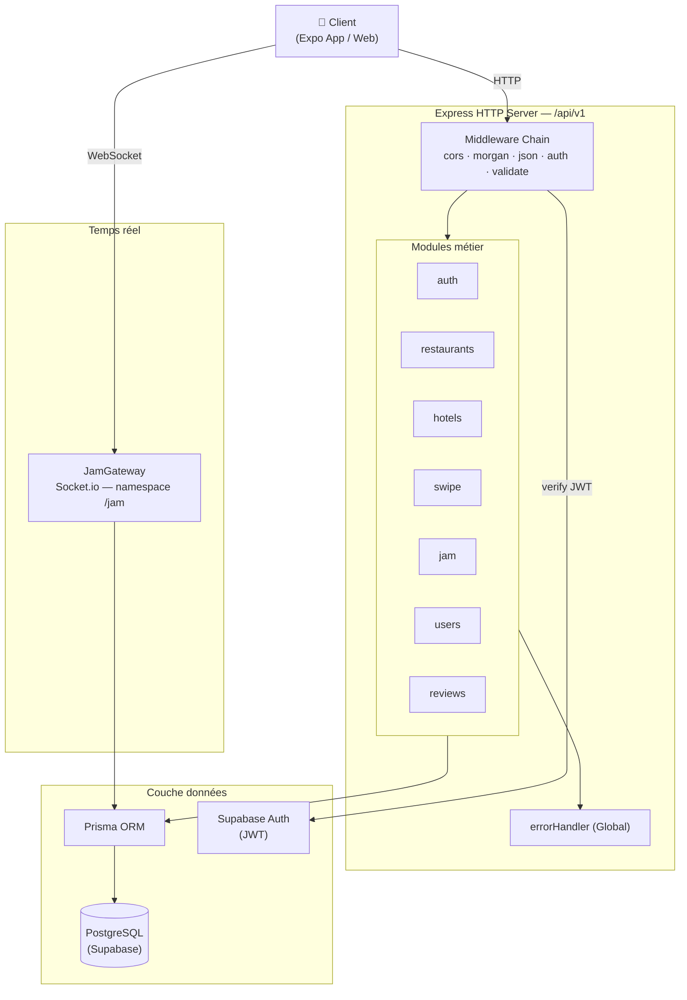
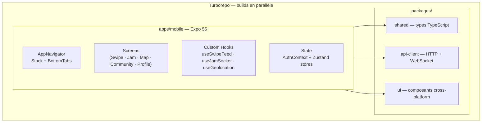
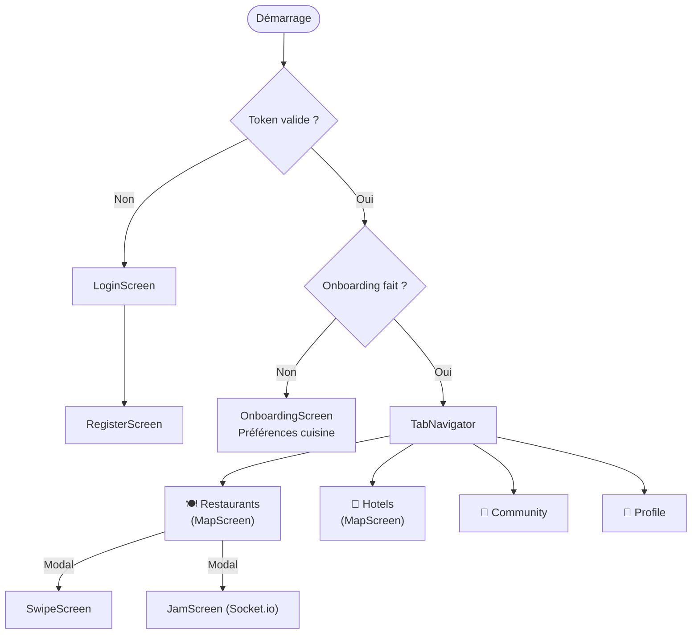
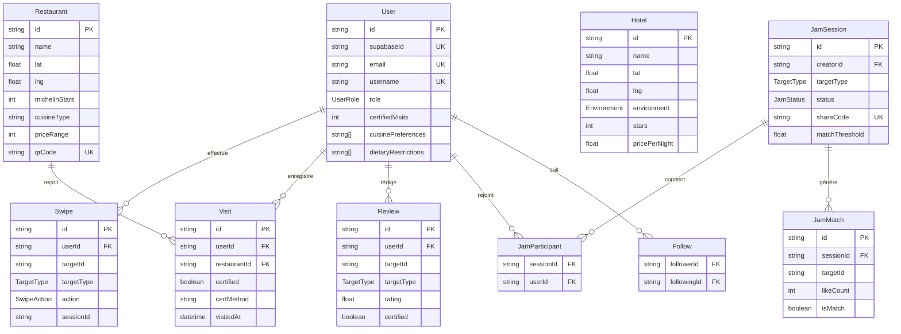
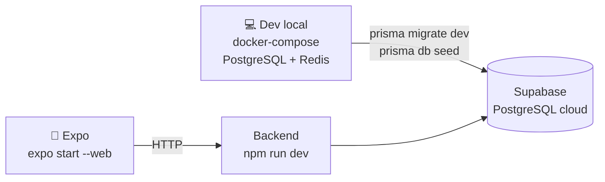
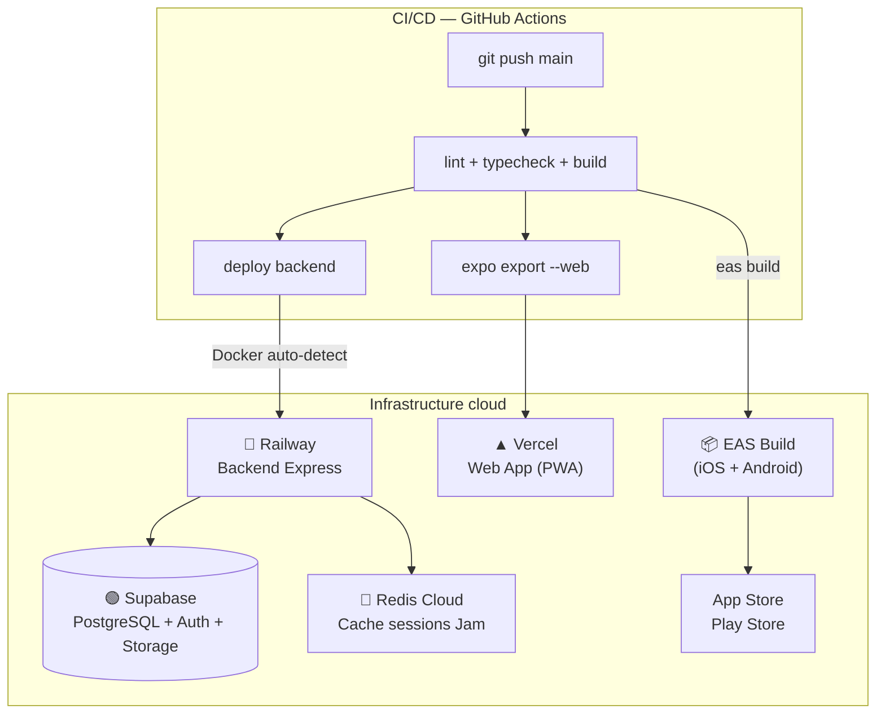
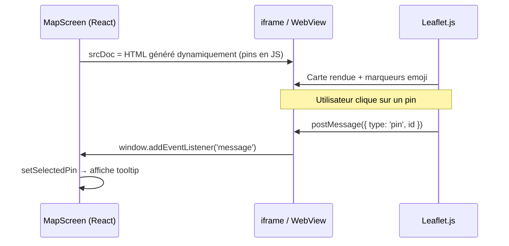
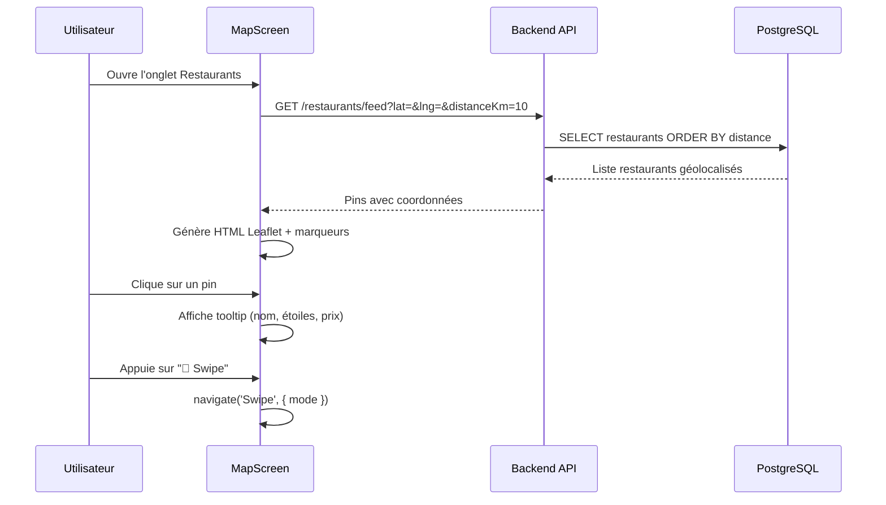
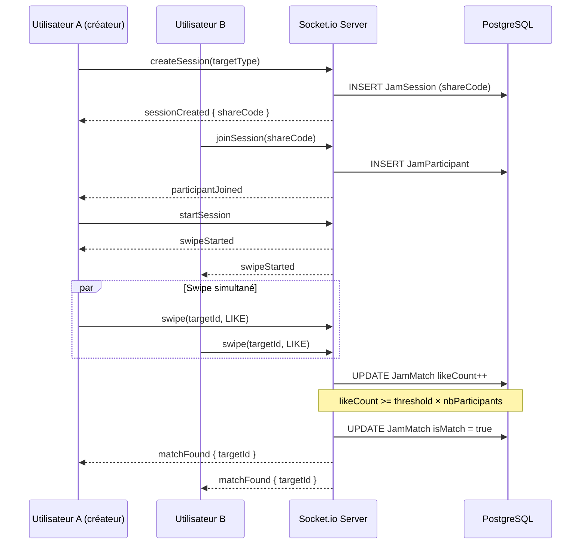

# MichelinMatch — Documentation Technique

> Application gastronomique sociale (restaurants & hôtels) avec swipe géolocalisé,
> sessions collaboratives en temps réel et gamification.

---

## Table des matières

1. [Architecture Backend](#1-architecture-backend)
2. [Architecture Frontend](#2-architecture-frontend)
3. [Modélisation de données et persistance](#3-modélisation-de-données-et-persistance)
4. [Configuration et déploiement](#4-configuration-et-déploiement)
5. [Application Mobile & Web — Mobile First](#5-application-mobile--web--mobile-first)

---

## 1. Architecture Backend

### Vue d'ensemble

Le backend suit une architecture **modulaire en couches** : chaque domaine métier est encapsulé dans son propre module (routeur → service → schéma de validation), sans fuite de responsabilité entre couches.



### Structure d'un module

```
modules/
└── restaurants/
    ├── restaurants.router.ts   ← routes Express uniquement
    ├── restaurants.service.ts  ← logique métier pure (pas d'Express)
    └── restaurants.schema.ts   ← schémas Zod (validation + inférence de types)
```

Les routes ne contiennent aucune logique. Les services ne connaissent pas Express. Cette séparation facilite les tests unitaires et la lisibilité.

### Justification des choix

| Choix | Raison (hackathon) | Ce qui aurait été idéal |
|---|---|---|
| **Express + TypeScript** | Mise en place immédiate, équipe familière | NestJS pour une structure encore plus stricte avec DI native et décorateurs |
| **Supabase Auth** | Auth complète (JWT, refresh tokens, gestion users) prête en 10 min | Auth custom (bcrypt + refresh tokens rotatifs) pour un contrôle total |
| **Prisma ORM** | Type-safety end-to-end, migrations auto, Studio visuel | Même choix — Prisma est bien adapté à ce scale |
| **Zod** | Validation + inférence TypeScript en un seul schéma | Même choix |
| **Socket.io** | Rooms natives, reconnexion auto, fallback polling | Même choix pour du temps réel à ce volume |

---

## 2. Architecture Frontend

### Monorepo Turborepo



### Navigation et flux utilisateur



### Gestion d'état

| Scope | Outil | Données gérées |
|---|---|---|
| Authentification | `AuthContext` (React Context) | token, user, isLoading |
| Feed de swipe | `feedStore` (Zustand) | cartes, index courant |
| Session Jam | `jamStore` (Zustand) | participants, statut, matches |
| Profil | `userStore` (Zustand) | collection, badges, follows |

**Choix de Zustand :** stores simples, sans boilerplate Redux, colocalisés par domaine. Un contexte React suffit pour l'auth (changement rare), Zustand pour les états qui évoluent fréquemment (feed, jam).

### Justification des choix

| Choix | Raison (hackathon) | Ce qui aurait été idéal |
|---|---|---|
| **Expo SDK 55** | Pas d'émulateur requis, `expo start --web` pour itérer sur navigateur | Même choix pour un MVP — React Native bare pour les modules natifs avancés en prod |
| **React Navigation v6** | Standard de facto, documentation exhaustive | Même choix |
| **Turborepo** | Types partagés backend ↔ frontend sans duplication, builds parallèles | Même choix |

---

## 3. Modélisation de données et persistance

### Schéma entité-relation



### Points clés du schéma

- **`TargetType` polymorphe** : `Swipe`, `Review` et `JamMatch` référencent un `targetId` (restaurant ou hôtel) via un enum — évite de doubler les tables de swipes pour chaque entité.
- **`UserRole` gamifié** : progression de `PLONGEUR` → `CHEF_ETOILE` selon `certifiedVisits`, stockée directement sur l'utilisateur pour des lectures rapides.
- **`certMethod` sur `Visit`** : trace comment la visite a été certifiée (QR, ...) — base extensible pour d'autres méthodes de certification futures.
- **`matchThreshold` sur `JamSession`** : paramètre configurable du pourcentage de likes nécessaires pour déclarer un match de groupe.

### Justification des choix

| Choix | Raison (hackathon) | Ce qui aurait été idéal |
|---|---|---|
| **PostgreSQL (Supabase)** | Inclus dans Supabase, migrations Prisma directes | Activer l'extension **PostGIS** (déjà dans l'image Docker) pour des requêtes géospatiales natives `ST_DWithin` — à la place du calcul de distance côté service |
| **CUID comme PK** | IDs sûrs pour les systèmes distribués, pas de séquence | UUID v7 (ordonné temporellement) serait une alternative |
| **Supabase Storage** | CDN intégré pour les photos de restaurants | Même choix |

---

## 4. Configuration et déploiement

### Environnements

```
backend/.env        ← DATABASE_URL, DIRECT_URL, SUPABASE_*, PORT, JWT_SECRET
apps/mobile/.env    ← EXPO_PUBLIC_API_URL, EXPO_PUBLIC_WS_URL
```

Le `docker-compose.yml` fournit PostgreSQL (avec PostGIS) et Redis en local.

### Ce qui a été mis en place



L'équipe a développé et démontré l'application en `expo start --web` (navigateur) + backend local, avec la base de données hébergée sur Supabase.

### Architecture cible (faute de temps)



**Choix de la stack de déploiement proposée :**

| Service | Rôle | Justification |
|---|---|---|
| **Railway** | Backend Express | Deploy depuis GitHub en 1 clic, Dockerfile auto-détecté, variables d'env via UI, free tier généreux |
| **Supabase** | DB + Auth + Storage | Déjà intégré, PostgreSQL managé avec backups automatiques |
| **Redis Cloud** | Cache sessions Jam actives | Évite de stocker l'état temps réel en base ; free tier 30 MB suffisant |
| **EAS Build** | Build natif iOS/Android | Pipeline officiel Expo, builds cloud sans émulateur local |
| **Vercel** | Web app (PWA) | Déploiement `expo export --platform web` en quelques secondes |
| **GitHub Actions** | CI/CD | Lint, type-check, migration DB automatique sur push `main` |

---

## 5. Application Mobile & Web — Mobile First

### Stratégie multi-plateforme

Expo permet de cibler iOS, Android et Web depuis une seule base de code. Pour les composants au comportement radicalement différent selon la plateforme, nous utilisons la **résolution automatique de fichiers** d'Expo :

```
MapScreen.tsx          ← types et props communs
MapScreen.native.tsx   ← react-native-maps (natif iOS/Android)
MapScreen.web.tsx      ← WebView + Leaflet (navigateur)
```

#### Pourquoi WebView + Leaflet sur le web ?

`react-native-maps` repose sur le SDK natif Google Maps / MapKit — des modules qui **ne fonctionnent pas dans un navigateur**. La configuration d'un émulateur Android/iOS en début de hackathon a consommé du temps. Nous avons basculé vers `expo start --web` pour accélérer les itérations.

La solution retenue génère du HTML Leaflet injecté dans un `<iframe>` (web) ou un `WebView` (natif), avec communication `postMessage` pour remonter les clics sur les marqueurs vers React Native.



> **Ce qui aurait été idéal :** `react-native-maps` en natif sur device physique pour le GPU, les clusters natifs et les animations fluides. Sur le web, `react-map-gl` (Mapbox GL) aurait offert plus de contrôle et de performance qu'un iframe Leaflet.

### Ergonomie Mobile First

Toutes les décisions UI sont pensées pour le tactile et les contraintes du mobile :

| Élément | Choix | Justification mobile |
|---|---|---|
| **Swipe cards** | Gestes natifs `PanResponder` | Interaction principale sur mobile, feedback haptique naturel |
| **Bottom tabs** | Hauteur 80px, paddingBottom 16px | Zone de pouce accessible, safe area iOS respectée |
| **Modales** | `presentation: 'modal'` (Jam, Swipe) | Navigation naturelle, dismiss par swipe vers le bas |
| **Thème** | Fond `#0A0A0A`, accent `#E8C547` | Contraste fort, lisible en extérieur, économe sur écrans OLED |
| **Touch targets** | Minimum 44×44px | Recommandation Apple HIG / Google Material Design |
| **Carte** | Plein écran + overlay contextuel | Immersion maximale sans quitter l'écran |

### Flux principal : de la carte au swipe



### Mode Jam — Sessions collaboratives temps réel

Plusieurs amis swipent **simultanément** et un match est déclaré quand un seuil de consensus (`matchThreshold`) est atteint.

